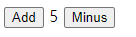

# Redux

## Vanilla Counter
- Store는 data를 저장하는 곳
- ✅ CreateStore는 reducer를 요구함.
- ✅ Reducer는 data를 modify 해주는 함수로 reducer가 return하는 것은 application에 있는 data가 됨.


- ✅ Action : redux에서 function을 부를 때 쓰는 두 번째 parameter 혹은 argument으로 reducer와 소통하기 위한 방법
- ✅ Reducer에게 Action을 보내는 방법 : store.dispatch({key: value});


- ✅ Subscribe : store 안에 있는 변화 감지
store.subscribe(func); // store안의 변화를 감지하면 func 실행




### < Recap >
- ✅ reducer : 현재 상태의 application과 함께 불려지는 function (+ with action)
return하는 것은 application의 state가 됨
- ✅ action : reducer와 소통하는 방법으로 Object여야 하며 그 key 이름은 항상 type임 (바꿀 수 없음)
- ✅ dispatch : reducer에게 action을 보내는 방법
- ✅ subscribe : store의 변화를 감지하면 인자값으로 준 함수를 실행
- ✅ switch가 자주 쓰임
```javascript
switch(action.type){
case ..blah..:
return smth
case ..blah2..:
return smth2
default:
return smth3
}
```
- ✅ string으로 바로 쓰는 대신에 const variable로 선언해서 사용하기 -> 에러 발견 용이 (오타 발생 시 에러메세지)


## Vanilla ToDo

- ✅ state는 single source of truth이며, read-only이다
- ✅ store을 수정할 수 있는 유일한 방법은 action을 보내는 방법뿐이다.
- ✅ state를 mutate하지 말아야한다. 
-> mutating state하는 대신에 new state objects를 리턴해야 한다.
- ✅ ...state -> state array안의 모든 content


- ✅ Delete ToDo


